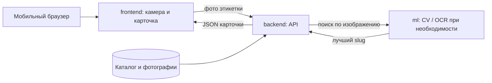

# Своё Вино 

**Мобильный сканер российских вин по фотографии этикетки.** Проект для кейса «РСХБ.Цифра» 2026: помочь покупателю у винной полки быстро узнать бутылку и открыть её карточку с данными из каталога «Своё Вино».

> **Статус:** интерфейс, локальный каталог и backend распознавания добавлены. Веса моделей хранятся через Git LFS. Серверная авторизация и оценка качества поиска пока не реализованы.

## Сценарий пользователя

1. Пользователь открывает сайт на телефоне и наводит камеру на этикетку или загружает фотографию из галереи.
2. Сервис ищет бутылку по изображению в каталоге. Цель по ТЗ — сразу показать **одну наиболее точную карточку**, без экрана выбора из похожих вин.
3. Карточка показывает название, винодельню, регион, сортовой состав, описание и фотографию. Дополнительные данные, например рейтинг Роскачества и сочетания с едой, отображаются только если они есть в источнике или придут из API.
4. Пользователь может сохранить вино в избранное, вернуться к истории просмотров, вести подборки и винный дневник. Раздел «Цифровой сомелье» подготовлен как место для подсказок после поиска.
5. Если точного совпадения нет, интерфейс сообщает об этом и даёт возможность переснять этикетку или перейти к каталогу. Выдача настоящих аналогов потребует поддержки поиска со стороны ML и бэкенда.

Дизайн опирается на [макет в Figma](https://www.figma.com/design/H0r9OoU4iYj1ehbgdAFRDE/%D0%A1%D0%B2%D0%BE%D1%91-%D0%92%D0%B8%D0%BD%D0%BE-%E2%80%94-Wine-Scanner?node-id=0-1). Основной экран и карточка сделаны в мобильной компоновке; отдельное нативное приложение не требуется.

## Что уже работает

| Возможность | Состояние |
| --- | --- |
| Каталог российских вин, поиск по названию, винодельне, региону и сорту | Работает локально, без сервера |
| Карточка вина с фотографией и доступным описанием | Работает при выборе вина из каталога |
| Камера, снимок этикетки и загрузка из галереи | Работает в браузере при разрешённом доступе к камере |
| Избранное, история, подборки, заметки в дневнике | Работают локально в этом браузере (`localStorage`) |
| Экран регистрации и входа | Формы готовы; создание аккаунта требует API |
| Распознавание этикетки и автоматическое открытие карточки | Backend и ML-пайплайн добавлены; требуется сквозная проверка на целевой машине |
| Персональные рекомендации и интерактивный сомелье | Пока не подключены |

В локальный каталог импортировано **2 103 карточки** с описаниями. Для **1 714 карточек** найдены проверенные фотографии из переданных датасетов; неоднозначные соответствия пропущены, чтобы не показывать неверную бутылку.

## Быстрый запуск фронтенда

Нужен Python 3. Сборка и установка npm-пакетов не требуются. Из корня проекта:

```powershell
python -m http.server 5173 --directory frontend
```

Откройте [http://localhost:5173](http://localhost:5173). На телефоне камера работает в защищённом контексте: по HTTPS либо на `localhost` самого устройства. При отсутствии доступа к камере можно загрузить готовый снимок из галереи.

Адрес бэкенда задаётся в [`frontend/config.js`](frontend/config.js):

```js
window.WINE_API_BASE = 'http://localhost:8000/api';
```

Пока значение пустое, сайт берёт карточки из `frontend/catalog.json`. При указанном адресе фронтенд ожидает API по контракту в [`docs/API.md`](docs/API.md). Для разных адресов фронтенда и API потребуется CORS или прокси. Логин и регистрация без сервера не создают аккаунт и показывают понятное сообщение.

## Запуск всего приложения в Docker

Убедитесь, что Git LFS скачал обязательные ML-артефакты, затем запустите:

```powershell
git lfs pull
Copy-Item .env.example .env
docker compose up --build
```

Сайт будет доступен на [http://localhost:8080](http://localhost:8080), API — на [http://localhost:8000](http://localhost:8000). Полная схема, список артефактов, команды и описание CI/CD находятся в [`docs/INFRASTRUCTURE.md`](docs/INFRASTRUCTURE.md). Ручные и автоматические проверки описаны в [`docs/TEST_CASES.md`](docs/TEST_CASES.md).

## Как части проекта соединяются



Сейчас каталог и изображения также доступны фронтенду напрямую для локального просмотра. Целевой путь после подключения ML — отправить фото бэкенду, получить идентификатор найденного вина и открыть соответствующую карточку. Браузер не вызывает модель напрямую.

| Папка | Назначение |
| --- | --- |
| [`frontend/`](frontend/) | HTML, CSS, JavaScript, экраны, камера, локальный каталог и клиент API |
| [`backend/`](backend/) | FastAPI, YOLO/SigLIP/FAISS/OCR-пайплайн, каталог и ML-артефакты |
| [`docker/`](docker/) | Nginx-конфигурация и entrypoint-скрипты контейнеров |
| [`docs/API.md`](docs/API.md) | Черновик форматов запросов и ответов между фронтом и бэкендом |
| [`scripts/import_wines.py`](scripts/import_wines.py) | Импорт проверенных пар «описание + фотография» из датасета |

Чтобы повторить импорт при наличии исходного CSV и всех трёх частей архива, нужен `UnRAR.exe` из WinRAR:

```powershell
python scripts/import_wines.py "C:/путь/к/Датасет"
```

Исходный датасет скрипт читает без изменения. Подробности запуска и полей каталога — в [`frontend/README.md`](frontend/README.md).

## Что нужно для соответствия ТЗ

- **Поиск:** устойчивое распознавание полевых фото с бликами, углом съёмки и плохим освещением; особое внимание почти одинаковым этикеткам разных лет и серий. Нормализация изображения и CV-поиск — зона ML.
- **Качество:** измерить на публичной и затем закрытой контрольной выборке долю верных совпадений и F1 для top-1/top-5. Цель кейса — **90–100% совпадений**; результатов измерений у текущего фронтенда нет.
- **Скорость:** целевой ответ до **3 секунд**. Это цель ТЗ, а не подтверждённая характеристика текущего проекта.
- **Проверочный скрипт:** для каждого фото нужен один лучший результат в плоском JSON `{"slug":"wine-slug"}`. Текущий черновик UI API использует `{"wine_id":"..."}` для `/api/scan`; при интеграции требуется отдельный совместимый маршрут или адаптер для скрипта кейсодержателя. Формат запроса скрипта нужно сверить с предоставленным им кодом.
- **После поиска:** довести до рабочей полезной функции рекомендации, аналоги или интерактивный сомелье. Нынешний экран советов использует доступные сведения карточки и общую подсказку; персональный подбор ещё не реализован.
- **Демо:** локальный сквозной прогон «фото → поиск → карточка», метрики и время ответа на публичном наборе. Внешний деплой по ТЗ не обязателен.
- **Документация:** перед сдачей добавить `ARCHITECTURE.md` с полным пайплайном нормализации фото, извлечения признаков, поиска, выдачи карточки и функции после поиска; зафиксировать переменные окружения и воспроизводимый запуск сервера.

Документ будет обновляться по мере появления кода бэкенда, ML, измерений и окончательного контракта API. Пока данные аккаунта не синхронизируются с сервером; токен при подключённой авторизации хранится в `sessionStorage`, а локальные списки и заметки — в `localStorage`.
