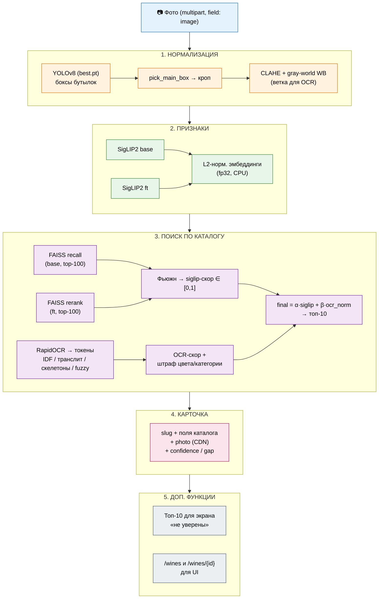

# Архитектура

Документ описывает пайплайн и границы слоёв: нормализация фото, извлечение признаков,
поиск по каталогу, выдача карточки, дополнительные функции. Практический запуск –
в [README.md](README.md).

## Обзор и путь запроса

## Границы слоёв

| Слой | Файл | Вход → выход |
|---|---|---|
| Конфигурация | `app/config.py` | – → `Paths` (автопоиск артефактов), `Cfg` (все гиперпараметры) |
| Модели и индексы | `app/models.py` | веса/индексы с диска → два энкодера, FAISS, `search_two` |
| Нормализация + поиск | `app/search.py` (`WinePipeline`) | PIL-изображение → features → ранжированный топ-10 → плоский JSON |
| OCR | `app/ocr.py` | кроп → токены с уверенностью (порог `ocr_conf_min`) |
| Текстовый матчинг | `app/textmatch.py` | токены запроса + каталог → ocr-скор (IDF, транслит, скелетоны, fuzzy) |
| HTTP | `app/main.py` | multipart/GET → JSON; сериализация карточки; CORS |

## [1] Нормализация входного фото

- Детекция: YOLOv8, дообученная на кропах этикеток (`artifacts/models/best.pt`),
  порог `yolo_conf=0.25`.
- Выбор главной бутылки (`pick_main_box`): эвристика «центральная и целиком видимая»
  скор = 0.45·центральность + 0.35·площадь + 0.20·conf, штраф ×0.5 за касание краёв
  (margin 2%). Веса – в `Cfg`.
- Для SigLIP: препроцессинг процессора модели (resize 384, patch16).
- Для OCR: CLAHE (clip 2.0, сетка 8×8) по L-каналу + gray-world white balance –
  компенсация разного света и угла съёмки «живых» фото.

## [2] Извлечение признаков

- Энкодер: SigLIP2 base-patch16-384, пул-выход, L2-нормализация → косинусное
  сходство как dot product в FAISS IndexFlatIP.
- Две модели: base (ступень recall) и дообученная на каталоге (ступень rerank).
- CPU-режим: fp32, без autocast; один препроцессинг изображения на оба энкодера.

## [3] Поиск по каталогу

Двухступенчатая схема retrieval:
- **Ступень recall:** base-эмбеддинг → FAISS `gallery.faiss`, top-100.
- **Ступень rerank:** ft-эмбеддинг → FAISS `gallery_finetuned.faiss`, top-100.
- Фьюжн визуального: `score` (0.8·cos_base + 0.2·cos_ft, дефолт) или `rrf`
  (k=60); результат нормируется делением на максимум → siglip-скор ∈ [0,1]
  в обоих режимах (режимы сравнимы напрямую).
- OCR-ветка: RapidOCR (кириллица, PP-OCRv5 mobile) → токены (порог уверенности
  0.5, стоп-слова, годы отбрасываются) → скоринг по каталогу.
- Штраф цвета/категории: если OCR увидел «белое», а позиция красная – скор
  домножается на 0.5/0.7; при пустой категории в каталоге штраф не применяется.
- Итог: `final = α·siglip + β·ocr/(ocr+ocr_norm)`, дефолт α=0.6, β=0.4,
  ocr_norm=40; альтернатива – мультипликативная схема (`scoring='mul'`).
  Отбор кандидатов до OCR-скоринга: top-`siglip_k`=100.

## [4] Выдача карточки

**Эндпоинты:**

| Метод | Путь | Назначение |
|---|---|---|
| `POST` | `/predict` | Распознавание фото → плоский JSON: `slug`, поля карточки, `confidence`, `gap`, `top1…topN` |
| `GET` | `/wines` | Список карточек каталога (пагинация `skip`/`limit`) |
| `GET` | `/wines/{id}` | Карточка по `slug`; `404 {"detail": …}`, если нет |
| `GET` | `/health` | Статус и готовность пайплайна |

## [5] Дополнительные функции после поиска

Реализовано:
- топ-10 кандидатов в ответе;
- метрики уверенности (`confidence`, `gap`);
- каталог и карточка (`/wines`, `/wines/{id}`, `/images/{filename}`).
