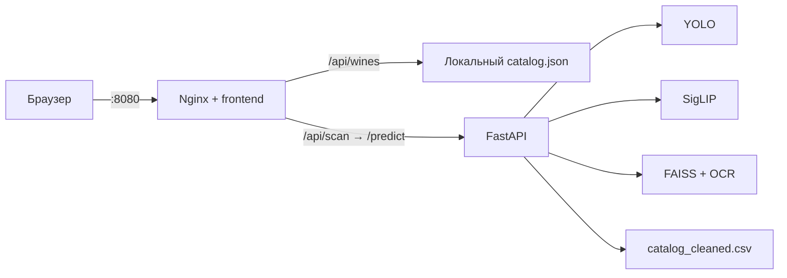

# Инфраструктура «Своё вино»

## Состав



- **frontend** — статический интерфейс в Nginx;
- **backend** — FastAPI и ML-пайплайн распознавания;
- **Nginx** — единая точка входа и адаптер между текущим фронтом и бэком;
- **hf-cache** — Docker volume для кэша базовой модели Hugging Face;
- **backend/artifacts** — локальные веса и индексы, подключённые в контейнер только для чтения.

## Что должно лежать в artifacts

Перед запуском проверьте файлы:

```text
backend/artifacts/models/best.pt
backend/artifacts/models/siglip_full_best.pt
backend/artifacts/indices/base.faiss
backend/artifacts/indices/finetuned.faiss
backend/artifacts/indices/base_slugs.json
backend/artifacts/indices/finetuned_slugs.json
```

В текущем рабочем проекте все перечисленные файлы присутствуют. Веса `.pt` хранятся через Git LFS, поэтому после нового клонирования выполните `git lfs pull`. Backend специально завершится с понятной ошибкой, если один из файлов отсутствует или вместо него остался LFS pointer. Большие ML-файлы не встраиваются в Docker image: они подключаются через bind mount при запуске.

## Локальный запуск

Нужен Docker Desktop с Compose v2.

```powershell
git lfs pull
Copy-Item .env.example .env
docker compose config
docker compose up --build
```

После успешного старта:

- сайт: `http://localhost:8080`;
- frontend healthcheck: `http://localhost:8080/health`;
- backend healthcheck: `http://localhost:8000/health`;
- backend через frontend proxy: `http://localhost:8080/api/health`.

Первый запуск backend может занять несколько минут: базовая SigLIP-модель загружается в volume `hf-cache`. Для этого контейнеру нужен доступ к Hugging Face. Backend запускается одним worker, потому что каждый worker отдельно загружает ML-модели в память.

Полезные команды:

```powershell
docker compose ps
docker compose logs -f backend
docker compose logs -f frontend
docker compose down
```

Порты можно изменить в `.env`:

```dotenv
FRONTEND_PORT=8080
BACKEND_PORT=8000
```

## Совместимость API

Текущий backend предоставляет только `GET /health` и `POST /predict`. Текущий frontend ожидает `/api/wines` и `/api/scan`, поэтому Nginx выполняет временную адаптацию:

- `/api/wines` возвращает существующий `frontend/catalog.json`;
- `/api/scan` передаёт запрос в backend `/predict`;
- неизвестные `/api/*` возвращают JSON с кодом 404.

Авторизация, личные подборки, избранное, история и дневник пока работают только как интерфейс и локальные данные браузера. Для серверного хранения backend должен позже реализовать соответствующие endpoints.

## CI/CD

### CI — `.github/workflows/ci.yml`

На каждый pull request и push в `main` или `develop` выполняются:

1. API и catalog contract tests;
2. проверка синтаксиса Python и JavaScript;
3. проверка `compose.yaml`;
4. тестовая сборка frontend image.

Полная сборка ML backend не выполняется в CI, чтобы обычная проверка не скачивала PyTorch и модели. Она выполняется в release workflow.

### CD — `.github/workflows/release.yml`

При push в `main`, теге `v*` или ручном запуске GitHub Actions собирает и публикует два образа:

```text
ghcr.io/<owner>/digital-sommelier-frontend
ghcr.io/<owner>/digital-sommelier-backend
```

Публикация идёт в GitHub Container Registry с тегами ветки, Git-тега, SHA и `latest` для основной ветки. Автоматический запуск на сервере не добавлен, потому что для него нужны адрес сервера, способ доставки ML-артефактов и секреты доступа.

На подготовленном сервере опубликованные образы запускаются отдельным production-файлом:

```powershell
$env:REGISTRY_IMAGE_PREFIX = "ghcr.io/<owner>/digital-sommelier"
$env:IMAGE_TAG = "latest"
docker compose -f compose.prod.yaml pull
docker compose -f compose.prod.yaml up -d
```

Перед этим на сервер нужно безопасно доставить каталог `backend/artifacts`. Backend-порт в production Compose доступен только через `127.0.0.1`; внешний трафик идёт через frontend/Nginx.

## Перед production-развёртыванием

- положить `siglip_full_best.pt` и индексы в защищённое хранилище артефактов;
- настроить HTTPS и домен;
- добавить постоянную БД и серверную авторизацию;
- ограничить CORS и размер/тип загружаемых файлов;
- добавить мониторинг CPU, RAM, времени распознавания и ошибок;
- провести нагрузочное тестирование на целевой машине с доступной памятью для всех ML-моделей.
